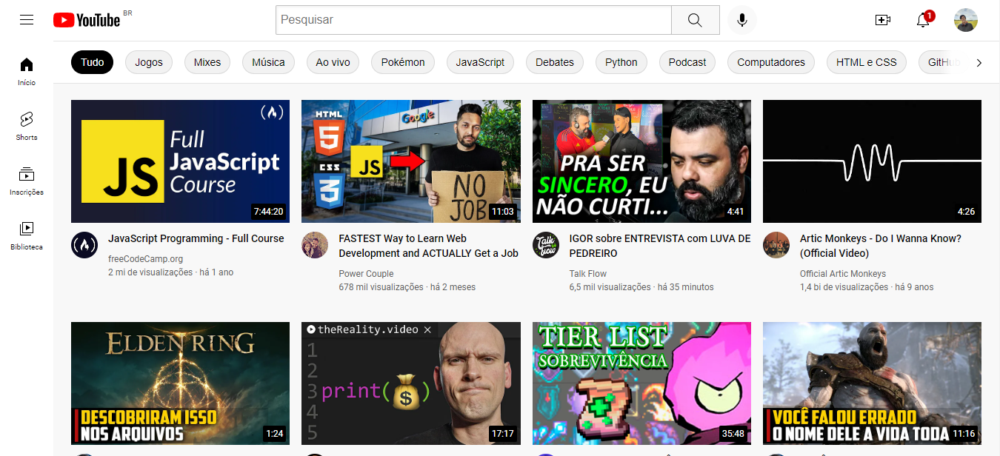
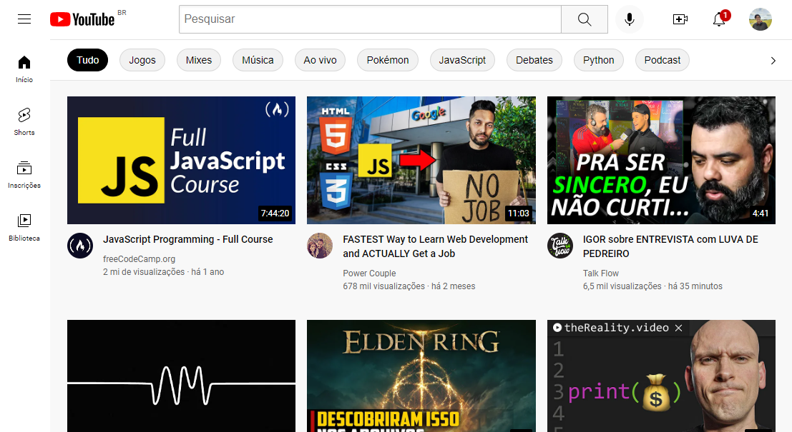
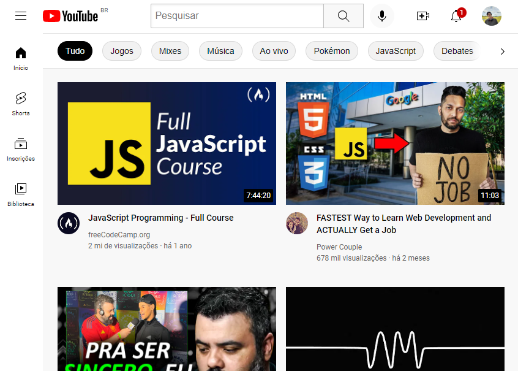
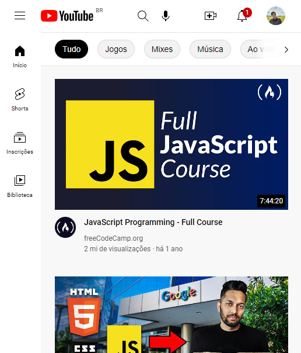
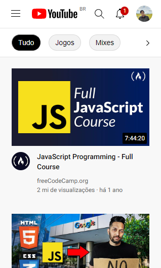

# YouTube Clone
Um clone da página do youtube.com, feito em HTML e CSS.

Este projeto é apenas visual, não possui nenhuma funcionalidade. O projeto também possui responsividade para dispositivos menores.

## Referências
* Este clone está sendo feito baseado no vídeo de [@SuperSimpleDev](https://www.youtube.com/watch?v=G3e-cpL7ofc&t=9387s&ab_channel=SuperSimpleDev). Entretanto, adicionei por conta própria algumas features, como a Barra superior que contém filtros para os vídeos (nomeei de topbar no código), e fiz algumas mudanças na responsividade.
* Todos os vídeos possuem um link para seus respectivos vídeos, basta clicar em qualquer parte do vídeo (thumbnail, título, ...).
* Todos os canais também possuem seus respectivos links, basta clicar no nome do canal.

## Imagens

| width: 1350px |
| ---- |
|  |

| width: 1110px |
| ---- |
|  |

| width: 850px |
| ---- |
|  |

| width: 520px |
| ---- |
|  |

| width: 320px |
| ---- |
|  |

---

<h3 align="center">Obrigado por olhar 😀, se gostou deixe uma estrela ⭐ para me ajudar.</h3>
